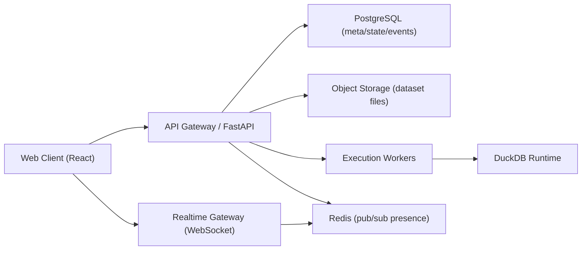

# DataModelBuilder V2 多人在线协作在线化改造方案（详细版）

更新时间：2026-03-17  
文档目标：将当前单机/单用户偏本地形态，升级为可部署、可分享、可审计、可实时协作的在线产品形态。  
适用代码基线：当前仓库 `main`（`React + Vite + FastAPI + DuckDB + 本地文件会话存储`）。

---

## 1. 现状与问题清单（基于代码）

当前系统更接近“本地工具 + 可选后端”的形态，而非“多人在线协作 SaaS”形态。关键现状如下：

1. 后端接口默认无鉴权，且 CORS 放开（`backend/main.py`）。
2. 会话状态主要落在本地目录（`data/sessions/*`），通过 JSON + DuckDB 文件管理（`backend/storage.py`）。
3. 状态保存是整块覆盖式写入，缺少版本号、并发控制、冲突回滚能力（`save_session_state`）。
4. 前端编辑流程没有协作协议，只在部分动作触发保存，天然存在“最后写入覆盖”的风险（`App.tsx`）。
5. 没有成员、角色、组织、工作区等多人产品基础模型。
6. 没有实时通道（WebSocket/SSE）推送远端变更与在线态。
7. 没有多租户隔离、审计日志、访问限流和配额体系。
8. Python transform 允许执行代码（`engine.py` 中 `exec`），在线化后安全风险显著提升。

---

## 2. 总体目标与非目标

### 2.1 总体目标

1. 支持多人访问同一个项目（Project）并协同编辑流程树。
2. 支持基础协作体验：在线成员、远端变更同步、冲突提示。
3. 支持组织/项目级权限控制（Owner/Admin/Editor/Viewer）。
4. 支持状态版本化与可追溯审计。
5. 支持线上稳定部署、监控、备份与故障恢复。

### 2.2 非目标（第一阶段）

1. 不做复杂 OT/CRDT 富文本级编辑算法（先做版本化 patch + 冲突合并）。
2. 不做跨区域多活部署（先单区域高可用）。
3. 不做企业级 SSO（先预留扩展点）。
4. 不将全部计算引擎重写为分布式（先保持单任务执行模型，可异步化）。

---

## 3. 分阶段交付策略

### Phase 1：可共享在线版（2-4 周）

1. 引入账号、登录、项目成员模型。
2. 完成 API 鉴权 + 权限校验。
3. 状态从“覆盖写入”升级为“版本化写入（baseVersion）”。
4. 前端接入登录与保存冲突提示。
5. 无实时推送，先通过轮询 + 手动刷新保障一致性。

### Phase 2：实时协作版（3-5 周）

1. 引入 WebSocket 协作通道。
2. 变更事件广播、在线成员状态同步。
3. 冲突处理体验完善（重试、比较、局部覆盖）。

### Phase 3：生产化增强（2-4 周）

1. 作业异步队列、限流配额、审计日志。
2. 安全加固（transform 沙箱/禁用策略、SQL 执行策略）。
3. 可观测性、备份恢复、灰度发布体系。

---

## 4. 目标架构设计

设计原则：

1. 元数据与协作状态入 PostgreSQL（可靠事务 + 并发控制）。
2. 大文件入对象存储（S3/MinIO），数据库只存索引。
3. 执行引擎可先内嵌，后续平滑迁移到 worker。
4. Realtime 层只做事件同步，不承载重计算。

---

## 5. 模块化方案设计 + 详细 TODO

以下每一节都包含“设计说明 + 详细 TODO”。

---

## 5.1 模块A：产品域模型（组织、成员、项目）

### 设计说明

1. 新增实体：`user`、`organization`、`organization_member`、`project`、`project_member`。
2. 当前 `session` 升级为 `project` 的运行容器，保留“工作流树 + 数据集引用 + SQL 历史”。
3. 每个 project 属于 organization；用户通过 membership 获取访问权。

### TODO（详细拆分）

- [ ] A-001 设计 ER 图并冻结字段命名规范（snake_case）。
- [ ] A-002 定义 `users` 表（id/email/password_hash/status/created_at/updated_at）。
- [ ] A-003 定义 `organizations` 表（id/name/owner_user_id/status）。
- [ ] A-004 定义 `organization_members` 表（org_id/user_id/role/invited_by/joined_at）。
- [ ] A-005 定义 `projects` 表（id/org_id/name/description/created_by/archived）。
- [ ] A-006 定义 `project_members` 表（project_id/user_id/role）。
- [ ] A-007 为 `project_members(project_id,user_id)` 建唯一索引。
- [ ] A-008 增加软删除字段策略（deleted_at）并约定查询过滤器。
- [ ] A-009 在后端代码中新增 domain model 与 DTO 映射层。
- [ ] A-010 编写迁移脚本（Alembic revision）并支持回滚。
- [ ] A-011 编写初始化脚本（创建默认组织 + 首个 owner）。
- [ ] A-012 增加项目命名规则校验（长度、字符、重名策略）。
- [ ] A-013 为 project 查询增加分页、排序、关键字搜索。
- [ ] A-014 定义归档策略（project archived 后只读）。
- [ ] A-015 验收：同组织多用户能看到同一项目列表，未授权用户不可见。

---

## 5.2 模块B：认证与授权（AuthN/AuthZ）

### 设计说明

1. 认证：`JWT Access Token + Refresh Token`。
2. 授权：基于项目角色的 RBAC，中间件统一校验。
3. 接口分级：公开接口、登录接口、项目读接口、项目写接口。

### TODO（详细拆分）

- [ ] B-001 新增 `POST /auth/register`。
- [ ] B-002 新增 `POST /auth/login`（返回 access + refresh）。
- [ ] B-003 新增 `POST /auth/refresh`（刷新 access token）。
- [ ] B-004 新增 `POST /auth/logout`（服务端失效 refresh token）。
- [ ] B-005 新增 refresh token 持久化表与吊销状态字段。
- [ ] B-006 增加密码策略（最小长度、复杂度、哈希算法）。
- [ ] B-007 实现 `get_current_user` 依赖注入。
- [ ] B-008 实现项目级权限装饰器（viewer/editor/admin/owner）。
- [ ] B-009 将所有 `/sessions/*` 改造为 `/projects/*` 且加权限检查。
- [ ] B-010 增加鉴权失败错误码规范（401/403 + code）。
- [ ] B-011 前端新增登录页与 token 存储策略（httpOnly/secure 优先）。
- [ ] B-012 前端 API 客户端自动附带 `Authorization`。
- [ ] B-013 前端处理 token 过期自动刷新与重试。
- [ ] B-014 编写越权访问测试（跨组织、跨项目、匿名访问）。
- [ ] B-015 验收：所有项目写接口必须在 editor+ 才可调用成功。

---

## 5.3 模块C：项目状态版本化与并发控制

### 设计说明

1. `project_state` 单独存储当前快照：`state_json + version + updated_by + updated_at`。
2. 保存接口必须带 `baseVersion`，后端使用事务校验版本一致后写入。
3. 版本冲突返回 409，并带 `latestVersion` + 可选 diff 提示。
4. 由“整树覆盖”升级为“patch 提交 + 服务器应用”模式。

### TODO（详细拆分）

- [ ] C-001 新建 `project_states` 表（project_id 唯一）。
- [ ] C-002 新建 `project_events` 表（event_id/project_id/version/op_type/op_payload/user_id）。
- [ ] C-003 设计 patch 协议（add_node/update_node/delete_node/reorder_node/update_command）。
- [ ] C-004 实现 `POST /projects/{id}/state:commit`。
- [ ] C-005 请求体增加 `baseVersion`、`clientOpId`、`patches[]`。
- [ ] C-006 事务内校验 `baseVersion == current_version`。
- [ ] C-007 成功后 `version +1` 并记录 events。
- [ ] C-008 冲突时返回 `409 + current_version + server_state_hash`。
- [ ] C-009 提供 `GET /projects/{id}/state?sinceVersion=xx` 增量拉取。
- [ ] C-010 提供 `GET /projects/{id}/events?from=xx&limit=xx` 回放接口。
- [ ] C-011 增加 `clientOpId` 幂等去重表（防止重试重复提交）。
- [ ] C-012 前端编辑动作改为本地生成 patch。
- [ ] C-013 前端增加自动保存防抖队列（例如 500ms）。
- [ ] C-014 前端冲突处理：提示“远端已更新”，支持刷新重放。
- [ ] C-015 增加状态快照压缩策略（每 N 个事件做快照）。
- [ ] C-016 验收：双浏览器并发编辑不会静默丢数据。

---

## 5.4 模块D：实时协作（WebSocket + Presence）

### 设计说明

1. 每个项目一个实时频道：`project:{id}`。
2. 服务端事件：`presence_join`、`presence_leave`、`state_committed`、`conflict_notice`。
3. 客户端处理：接收远端 patch，按版本顺序应用到本地状态。

### TODO（详细拆分）

- [ ] D-001 选择实时协议（原生 WebSocket）。
- [ ] D-002 新增 `GET /ws/projects/{id}` 握手，校验 token。
- [ ] D-003 建立连接上下文（user_id/project_id/last_seen_version）。
- [ ] D-004 引入 Redis pub/sub（多实例广播）。
- [ ] D-005 设计广播消息结构（event_type/version/payload/server_time）。
- [ ] D-006 客户端连接后发送 `subscribe` 与 `client_version`。
- [ ] D-007 服务端回放缺失事件（from client_version+1）。
- [ ] D-008 客户端实现断线重连与指数退避。
- [ ] D-009 客户端实现重连后版本追赶逻辑。
- [ ] D-010 客户端实现在线成员列表展示（头像/昵称/角色）。
- [ ] D-011 客户端实现“正在编辑节点”广播（可选节流）。
- [ ] D-012 增加心跳机制（ping/pong + 超时踢断）。
- [ ] D-013 增加消息签名字段或会话校验防串房。
- [ ] D-014 增加乱序消息保护（丢弃低版本消息）。
- [ ] D-015 增加重复消息去重（event_id 集合）。
- [ ] D-016 验收：A 用户改名节点，B 用户 1 秒内可见更新。

---

## 5.5 模块E：数据集与文件存储升级

### 设计说明

1. 文件从本地目录迁移为对象存储（S3/MinIO），后端生成存储键。
2. 数据集元信息入库：`dataset_assets`。
3. 执行查询时由后端读取对象存储文件并映射到 DuckDB。

### TODO（详细拆分）

- [ ] E-001 新建 `dataset_assets` 表（id/project_id/name/object_key/format/rows/schema_json/created_by）。
- [ ] E-002 抽象存储接口 `StorageBackend`（put/get/delete/signed_url）。
- [ ] E-003 保留 LocalFileBackend 作为 dev fallback。
- [ ] E-004 增加 S3Backend（兼容 MinIO endpoint）。
- [ ] E-005 上传接口改造为两步：预签名上传 or 直传代理。
- [ ] E-006 上传完成后解析 schema 并写 dataset_assets。
- [ ] E-007 对重名数据集定义策略（replace/new_version/new_name）。
- [ ] E-008 增加数据集版本号字段（dataset_version）。
- [ ] E-009 预览接口读取对象存储并限制默认行数。
- [ ] E-010 删除数据集时同步删除对象与元数据（软删可选）。
- [ ] E-011 增加文件大小上限、类型白名单、分块上传策略。
- [ ] E-012 增加导入失败补偿逻辑（元数据回滚）。
- [ ] E-013 增加生命周期策略（冷存储/过期清理）。
- [ ] E-014 增加对象存储连接健康检查接口。
- [ ] E-015 验收：同项目多用户都可读取同一数据集预览。

---

## 5.6 模块F：执行引擎与任务调度

### 设计说明

1. 现有 `/execute` 同步执行保留，但要增加资源保护。
2. 增加异步任务通道用于长任务（大数据导出/复杂计算）。
3. 引擎上下文从 `session_id` 改为 `project_id`。

### TODO（详细拆分）

- [ ] F-001 将执行入口参数统一为 `projectId`。
- [ ] F-002 抽离执行上下文构建器（读取项目状态+数据集映射）。
- [ ] F-003 增加同步执行超时控制（例如 30s）。
- [ ] F-004 增加请求级内存阈值保护。
- [ ] F-005 增加查询行数上限与分页上限。
- [ ] F-006 定义异步任务表 `jobs`（id/type/status/progress/result/error）。
- [ ] F-007 新增 `POST /projects/{id}/jobs/execute`。
- [ ] F-008 新增 `GET /jobs/{id}` 和 `GET /jobs/{id}/result`。
- [ ] F-009 后台 worker 拉取任务执行并回写状态。
- [ ] F-010 前端增加长任务进度 UI（排队/运行/完成/失败）。
- [ ] F-011 导出接口改为异步生成文件并返回下载链接。
- [ ] F-012 增加任务取消接口 `POST /jobs/{id}:cancel`。
- [ ] F-013 增加任务并发配额（每项目同时运行上限）。
- [ ] F-014 对执行错误做标准化分类（用户错误/系统错误/超时）。
- [ ] F-015 验收：大任务不阻塞主请求线程，用户可查询进度。

---

## 5.7 模块G：前端协作化改造

### 设计说明

1. 以 `projectStore` 为中心，状态包含 `snapshot/version/pendingPatches/connectionState`。
2. 所有编辑动作先写本地 store，再进入提交队列。
3. 收到远端事件按版本应用，保证最终一致。

### TODO（详细拆分）

- [ ] G-001 新建前端状态层（建议 Zustand 或 Context + reducer）。
- [ ] G-002 设计统一 action（ADD_NODE/UPDATE_COMMAND/...）。
- [ ] G-003 为每个 action 生成 patch 与本地回放函数。
- [ ] G-004 新增自动保存管理器（防抖 + 合并 patch）。
- [ ] G-005 新增“保存状态指示器”（已保存/保存中/冲突）。
- [ ] G-006 新增“实时连接状态指示器”（在线/重连中/离线）。
- [ ] G-007 实现登录态守卫与路由切换。
- [ ] G-008 改造 API 客户端，支持 token 刷新与统一错误处理。
- [ ] G-009 改造 `App.tsx` 会话逻辑为项目逻辑。
- [ ] G-010 替换 `sessionId` 相关 props 为 `projectId`。
- [ ] G-011 新增项目成员管理页（邀请、移除、角色修改）。
- [ ] G-012 新增冲突弹窗（展示远端版本与本地未提交变更）。
- [ ] G-013 新增手动同步按钮（应急恢复）。
- [ ] G-014 新增远端编辑提示（某人正在编辑某节点）。
- [ ] G-015 新增本地草稿恢复机制（断网场景）。
- [ ] G-016 验收：在弱网下可恢复编辑并最终同步成功。

---

## 5.8 模块H：API 合约与兼容策略

### 设计说明

1. 保留旧接口一段时间，通过网关映射到新模型，平滑迁移。
2. 新接口全部加 `v2` 前缀或明确文档版本。
3. 错误结构统一，便于前端渲染与监控归类。

### TODO（详细拆分）

- [ ] H-001 定义 API 命名规范与版本策略文档。
- [ ] H-002 输出 OpenAPI 文档并自动生成 schema。
- [ ] H-003 定义统一响应 envelope（data/error/meta/request_id）。
- [ ] H-004 定义错误码字典（AUTH_*, PERM_*, CONFLICT_*, VALIDATION_*）。
- [ ] H-005 新增请求追踪头 `X-Request-ID`。
- [ ] H-006 兼容层：旧 `/sessions/*` 转发新 `/projects/*`（可配置开关）。
- [ ] H-007 标记废弃接口并给出 deprecation 提示头。
- [ ] H-008 为关键接口加 idempotency-key 支持。
- [ ] H-009 为上传、执行、提交接口增加速率限制。
- [ ] H-010 输出前后端合约测试（contract test）。
- [ ] H-011 对外发布 API 变更日志（changelog）。
- [ ] H-012 验收：前端升级期间可同时兼容旧数据与新接口。

---

## 5.9 模块I：安全与合规

### 设计说明

1. 在线版本必须最先解决认证、授权、输入校验、资源滥用风险。
2. Python transform 为高危点，必须限制。
3. SQL 查询能力需要最小权限原则与审计。

### TODO（详细拆分）

- [ ] I-001 收紧 CORS（仅白名单域名）。
- [ ] I-002 统一请求体校验（Pydantic 严格模式，限制额外字段）。
- [ ] I-003 上传文件加 MIME 校验与恶意内容检测。
- [ ] I-004 增加单用户、单项目请求限流策略。
- [ ] I-005 增加登录失败次数限制与账户锁定策略。
- [ ] I-006 transform 默认禁用 `exec` 模式或仅允许安全表达式。
- [ ] I-007 若保留 Python transform，迁移至沙箱执行容器。
- [ ] I-008 SQL 接口限制只读语句，禁用 DDL/DML（按产品策略）。
- [ ] I-009 增加 SQL 超时和扫描量限制。
- [ ] I-010 所有关键写操作记录审计日志。
- [ ] I-011 敏感配置转为环境变量与密钥管理服务。
- [ ] I-012 增加依赖漏洞扫描（pip/npm audit）。
- [ ] I-013 增加安全测试用例（注入、越权、遍历、暴力）。
- [ ] I-014 编写安全应急手册（token 泄露、账号被盗、恶意脚本）。
- [ ] I-015 验收：通过一轮基础渗透测试且高危问题清零。

---

## 5.10 模块J：可观测性与运维

### 设计说明

1. 线上协作系统必须具备日志、指标、链路追踪三件套。
2. 协作核心指标：提交延迟、冲突率、同步延迟、在线人数、失败率。

### TODO（详细拆分）

- [ ] J-001 日志结构化（JSON）并统一字段（request_id/user_id/project_id）。
- [ ] J-002 增加关键业务日志（提交、冲突、广播、重连、作业状态变更）。
- [ ] J-003 暴露 Prometheus 指标端点。
- [ ] J-004 新增指标：API p95、commit 成功率、409 冲突率。
- [ ] J-005 新增指标：WS 在线连接数、消息广播延迟。
- [ ] J-006 新增指标：任务队列长度、任务失败率、平均执行耗时。
- [ ] J-007 接入链路追踪（OpenTelemetry）。
- [ ] J-008 配置告警规则（高冲突率、高错误率、服务不可用）。
- [ ] J-009 定义 SLO（可用性、延迟、错误预算）。
- [ ] J-010 实现健康检查与就绪检查端点。
- [ ] J-011 增加数据库慢查询日志采样。
- [ ] J-012 增加数据备份与恢复演练流程。
- [ ] J-013 增加对象存储可用性探活与告警。
- [ ] J-014 编写运维 Runbook（扩容、回滚、故障切换）。
- [ ] J-015 验收：一次演练中 30 分钟内可完成故障恢复。

---

## 5.11 模块K：测试策略（单测/集成/E2E/压测）

### 设计说明

1. 协作系统的核心风险在并发与时序，测试必须覆盖“多客户端同时编辑”。
2. 覆盖层级：后端单测、接口集成、双端 E2E、压力测试、混沌测试。

### TODO（详细拆分）

- [ ] K-001 补充数据库模型与迁移单测。
- [ ] K-002 补充权限单测（角色矩阵全覆盖）。
- [ ] K-003 补充提交接口并发测试（同版本竞争提交）。
- [ ] K-004 补充事件回放一致性测试（断线重连场景）。
- [ ] K-005 补充 WebSocket 掉线/重连/乱序测试。
- [ ] K-006 增加双浏览器 Playwright 协作用例。
- [ ] K-007 增加“冲突出现 -> 提示 -> 用户处理”UI 用例。
- [ ] K-008 增加上传并发与大文件导入测试。
- [ ] K-009 增加执行任务排队与取消测试。
- [ ] K-010 增加压测脚本（100 并发编辑，1000 连接在线）。
- [ ] K-011 增加长稳测试（24h reconnect + commit 稳定性）。
- [ ] K-012 增加安全回归测试到 CI。
- [ ] K-013 设定覆盖率门槛（后端/前端最小阈值）。
- [ ] K-014 配置 CI 分层流水线（快速检查/完整回归/夜间压测）。
- [ ] K-015 验收：关键协作路径测试全部自动化并稳定通过。

---

## 5.12 模块L：数据迁移与兼容发布

### 设计说明

1. 需把现有 `data/sessions/*` 资产迁移到新 `project + dataset_assets + project_states` 模型。
2. 发布采用灰度策略，先小范围试点，避免全量切换风险。

### TODO（详细拆分）

- [ ] L-001 设计迁移映射规则（session -> project）。
- [ ] L-002 编写迁移扫描器（读取旧目录结构与状态文件）。
- [ ] L-003 编写迁移执行器（写入新库 + 上传对象存储）。
- [ ] L-004 迁移时保留旧 id 与新 id 映射表。
- [ ] L-005 迁移 SQL 历史、metadata、datasets 索引。
- [ ] L-006 迁移异常重试机制与错误报告输出。
- [ ] L-007 提供 dry-run 模式（只校验不写入）。
- [ ] L-008 增加迁移后校验器（行数、字段、状态 hash 比对）。
- [ ] L-009 设计双写窗口（新旧存储并行一段时间）。
- [ ] L-010 设计回滚方案（按项目回切旧系统）。
- [ ] L-011 编写灰度计划（5% -> 20% -> 50% -> 100%）。
- [ ] L-012 定义每阶段准入指标（错误率、冲突率、延迟）。
- [ ] L-013 输出迁移与发布操作手册。
- [ ] L-014 组织一次全链路彩排（含回滚）。
- [ ] L-015 验收：迁移后随机抽样项目结果一致，业务可用。

---

## 5.13 模块M：项目管理与里程碑治理

### 设计说明

1. 采用里程碑 + 风险清单 + 决策记录（ADR）治理。
2. 每个里程碑必须有“可演示成果 + 可量化验收指标”。

### TODO（详细拆分）

- [ ] M-001 创建项目看板（按模块A-M划分泳道）。
- [ ] M-002 每个模块指定 Owner 与备份 Owner。
- [ ] M-003 输出 WBS（工作分解）与关键路径。
- [ ] M-004 每周输出进度报告（完成率/风险/阻塞）。
- [ ] M-005 建立 ADR 模板并记录关键架构决策。
- [ ] M-006 建立风险台账（技术/产品/安全/运维）。
- [ ] M-007 风险分级与应对策略（P0-P3）。
- [ ] M-008 设立上线 Go/No-Go 检查清单。
- [ ] M-009 设立试点客户反馈回路与需求收敛机制。
- [ ] M-010 设立 bug bash 与稳定性冲刺窗口。
- [ ] M-011 设立上线后 7 天重点值守计划。
- [ ] M-012 输出版本发布说明模板。
- [ ] M-013 设立复盘模板（技术与流程双复盘）。
- [ ] M-014 验收：每个里程碑都有可复用产出与明确决策记录。

---

## 6. 里程碑排期（建议）

| 里程碑 | 时间建议 | 目标 |
|---|---|---|
| Milestone-1 | 第1-2周 | 模块A/B/C核心能力可跑通（账号、项目、版本化提交） |
| Milestone-2 | 第3-4周 | 模块E/G/H落地（项目在线编辑、状态提交、数据集在线化） |
| Milestone-3 | 第5-6周 | 模块D实时协作 + 模块K关键协作测试通过 |
| Milestone-4 | 第7-8周 | 模块I/J/L上线准备（安全、观测、迁移、灰度） |

---

## 7. 上线验收标准（Definition of Done）

1. 功能验收：多人可同时进入同一项目并看到远端变更。
2. 一致性验收：并发提交不出现静默覆盖，冲突可感知可处理。
3. 权限验收：跨项目、跨组织越权访问全部被拦截。
4. 性能验收：核心 API 在目标负载下满足约定 p95。
5. 稳定性验收：断线重连、服务重启后协作可恢复。
6. 安全验收：高危漏洞清零，核心日志可审计。
7. 可运维验收：监控告警、备份恢复、回滚预案已演练。

---

## 8. 第一批实施优先级（建议你先做）

1. 模块B（认证授权）+ 模块C（版本化提交）先落地，这是多人协作底座。
2. 模块G 前端 patch 化改造同步进行，尽早消除整树覆盖写风险。
3. 模块D 实时能力可放在第二波，不阻塞“可用在线版”上线。
4. 模块I 安全基线必须并行推进，不建议后置。

---

## 9. 附录：与当前代码直接关联的改造入口

1. `backend/main.py`：路由重组、鉴权注入、协作接口新增。
2. `backend/storage.py`：从本地会话存储抽象为可插拔存储层。
3. `backend/engine.py`：执行上下文从 session 改 project，控制 transform 风险。
4. `App.tsx`：前端状态流重构为协作 store + 提交队列。
5. `utils/api.ts`：统一 auth header、错误码、重试、冲突处理。
6. `types.ts`：新增协作协议类型（version、patch、event、presence）。

