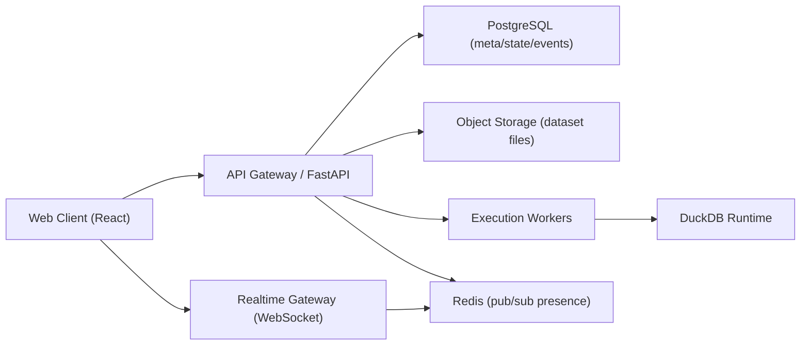
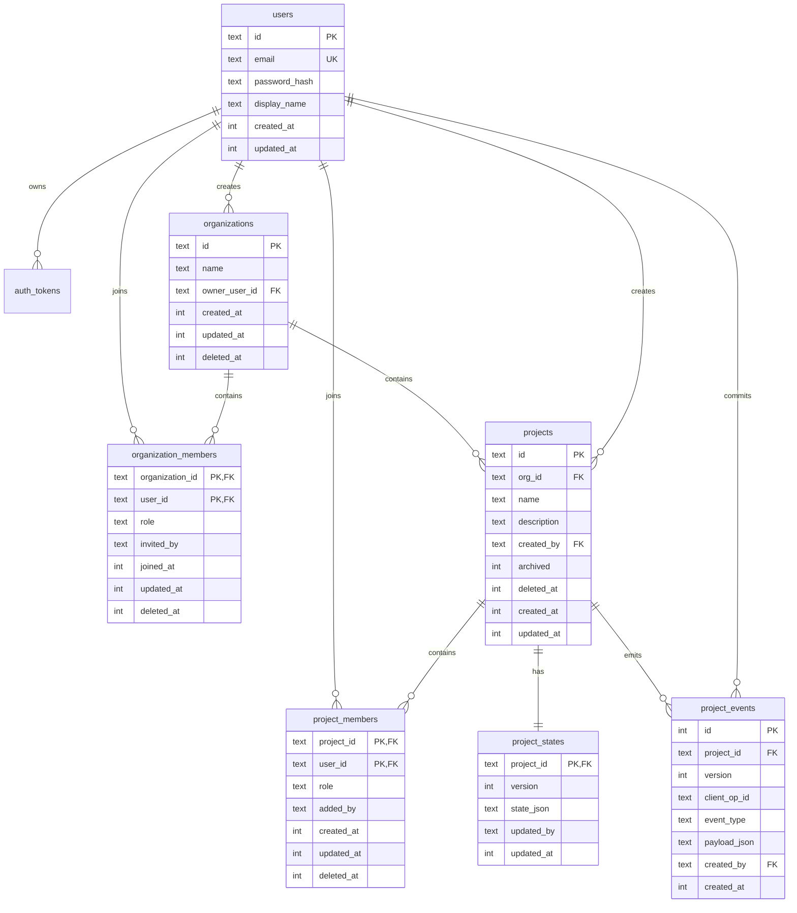

# DataModelBuilder V2 多人在线协作在线化改造方案（详细版）

更新时间：2026-03-17  
文档目标：将当前单机/单用户偏本地形态，升级为可部署、可分享、可审计、可实时协作的在线产品形态。  
适用代码基线：当前仓库 `main`（`React + Vite + FastAPI + DuckDB + 本地文件会话存储`）。

---

## 1. 现状与问题清单（基于代码）

当前系统更接近“本地工具 + 可选后端”的形态，而非“多人在线协作 SaaS”形态。关键现状如下：

1. 后端接口默认无鉴权，且 CORS 放开（`backend/main.py`）。
2. 会话状态主要落在本地目录（`data/sessions/*`），通过 JSON + DuckDB 文件管理（`backend/storage.py`）。
3. 状态保存是整块覆盖式写入，缺少版本号、并发控制、冲突回滚能力（`save_session_state`）。
4. 前端编辑流程没有协作协议，只在部分动作触发保存，天然存在“最后写入覆盖”的风险（`App.tsx`）。
5. 没有成员、角色、组织、工作区等多人产品基础模型。
6. 没有实时通道（WebSocket/SSE）推送远端变更与在线态。
7. 没有多租户隔离、审计日志、访问限流和配额体系。
8. Python transform 允许执行代码（`engine.py` 中 `exec`），在线化后安全风险显著提升。

---

## 2. 总体目标与非目标

### 2.1 总体目标

1. 支持多人访问同一个项目（Project）并协同编辑流程树。
2. 支持基础协作体验：在线成员、远端变更同步、冲突提示。
3. 支持组织/项目级权限控制（Owner/Admin/Editor/Viewer）。
4. 支持状态版本化与可追溯审计。
5. 支持线上稳定部署、监控、备份与故障恢复。

### 2.2 非目标（第一阶段）

1. 不做复杂 OT/CRDT 富文本级编辑算法（先做版本化 patch + 冲突合并）。
2. 不做跨区域多活部署（先单区域高可用）。
3. 不做企业级 SSO（先预留扩展点）。
4. 不将全部计算引擎重写为分布式（先保持单任务执行模型，可异步化）。

---

## 3. 分阶段交付策略

### Phase 1：可共享在线版（2-4 周）

1. 引入账号、登录、项目成员模型。
2. 完成 API 鉴权 + 权限校验。
3. 状态从“覆盖写入”升级为“版本化写入（baseVersion）”。
4. 前端接入登录与保存冲突提示。
5. 无实时推送，先通过轮询 + 手动刷新保障一致性。

### Phase 2：实时协作版（3-5 周）

1. 引入 WebSocket 协作通道。
2. 变更事件广播、在线成员状态同步。
3. 冲突处理体验完善（重试、比较、局部覆盖）。

### Phase 3：生产化增强（2-4 周）

1. 作业异步队列、限流配额、审计日志。
2. 安全加固（transform 沙箱/禁用策略、SQL 执行策略）。
3. 可观测性、备份恢复、灰度发布体系。

---

## 4. 目标架构设计

设计原则：

1. 元数据与协作状态入 PostgreSQL（可靠事务 + 并发控制）。
2. 大文件入对象存储（S3/MinIO），数据库只存索引。
3. 执行引擎可先内嵌，后续平滑迁移到 worker。
4. Realtime 层只做事件同步，不承载重计算。

---

## 5. 模块化方案设计 + 详细 TODO

以下每一节都包含“设计说明 + 详细 TODO”。

---

## 5.1 模块A：产品域模型（组织、成员、项目）

### 设计说明

1. 新增实体：`user`、`organization`、`organization_member`、`project`、`project_member`。
2. 当前 `session` 升级为 `project` 的运行容器，保留“工作流树 + 数据集引用 + SQL 历史”。
3. 每个 project 属于 organization；用户通过 membership 获取访问权。

### ER 图与命名规范（A-001）

字段命名冻结规则：
1. 数据库统一 `snake_case`。
2. 主键字段统一 `id`，关联键统一 `<entity>_id`。
3. 软删除统一 `deleted_at`（毫秒时间戳，NULL 表示未删除）。
4. 时间字段统一 `created_at`/`updated_at`（毫秒时间戳）。
5. 布尔状态字段统一 `INTEGER(0/1)`（如 `archived`、`revoked`）。

### TODO（详细拆分）

- [x] A-001 设计 ER 图并冻结字段命名规范（snake_case）。
- [x] A-002 定义 `users` 表（id/email/password_hash/status/created_at/updated_at）。
- [x] A-003 定义 `organizations` 表（id/name/owner_user_id/status）。
- [x] A-004 定义 `organization_members` 表（org_id/user_id/role/invited_by/joined_at）。
- [x] A-005 定义 `projects` 表（id/org_id/name/description/created_by/archived）。
- [x] A-006 定义 `project_members` 表（project_id/user_id/role）。
- [x] A-007 为 `project_members(project_id,user_id)` 建唯一索引。
- [x] A-008 增加软删除字段策略（deleted_at）并约定查询过滤器。
- [x] A-009 在后端代码中新增 domain model 与 DTO 映射层。
- [x] A-010 编写迁移脚本（Alembic revision）并支持回滚。
- [x] A-011 编写初始化脚本（创建默认组织 + 首个 owner）。
- [x] A-012 增加项目命名规则校验（长度、字符、重名策略）。
- [x] A-013 为 project 查询增加分页、排序、关键字搜索。
- [x] A-014 定义归档策略（project archived 后只读）。
- [x] A-015 验收：同组织多用户能看到同一项目列表，未授权用户不可见。

---

## 5.2 模块B：认证与授权（AuthN/AuthZ）

### 设计说明

1. 认证：`JWT Access Token + Refresh Token`。
2. 授权：基于项目角色的 RBAC，中间件统一校验。
3. 接口分级：公开接口、登录接口、项目读接口、项目写接口。

### TODO（详细拆分）

- [x] B-001 新增 `POST /auth/register`。
- [x] B-002 新增 `POST /auth/login`（返回 access + refresh）。
- [x] B-003 新增 `POST /auth/refresh`（刷新 access token）。
- [x] B-004 新增 `POST /auth/logout`（服务端失效 refresh token）。
- [x] B-005 新增 refresh token 持久化表与吊销状态字段。
- [x] B-006 增加密码策略（最小长度、复杂度、哈希算法）。
- [x] B-007 实现 `get_current_user` 依赖注入。
- [x] B-008 实现项目级权限装饰器（viewer/editor/admin/owner）。
- [x] B-009 将所有 `/sessions/*` 改造为 `/projects/*` 且加权限检查。
- [x] B-010 增加鉴权失败错误码规范（401/403 + code）。
- [x] B-011 前端新增登录页与 token 存储策略（httpOnly/secure 优先）。
- [x] B-012 前端 API 客户端自动附带 `Authorization`。
- [x] B-013 前端处理 token 过期自动刷新与重试。
- [x] B-014 编写越权访问测试（跨组织、跨项目、匿名访问）。
- [x] B-015 验收：所有项目写接口必须在 editor+ 才可调用成功。

---

## 5.3 模块C：项目状态版本化与并发控制

### 设计说明

1. `project_state` 单独存储当前快照：`state_json + version + updated_by + updated_at`。
2. 保存接口必须带 `baseVersion`，后端使用事务校验版本一致后写入。
3. 版本冲突返回 409，并带 `latestVersion` + 可选 diff 提示。
4. 由“整树覆盖”升级为“patch 提交 + 服务器应用”模式。

### TODO（详细拆分）

- [x] C-001 新建 `project_states` 表（project_id 唯一）。
- [x] C-002 新建 `project_events` 表（event_id/project_id/version/op_type/op_payload/user_id）。
- [x] C-003 设计 patch 协议（add_node/update_node/delete_node/reorder_node/update_command）。
- [x] C-004 实现 `POST /projects/{id}/state:commit`。
- [x] C-005 请求体增加 `baseVersion`、`clientOpId`、`patches[]`。
- [x] C-006 事务内校验 `baseVersion == current_version`。
- [x] C-007 成功后 `version +1` 并记录 events。
- [x] C-008 冲突时返回 `409 + current_version + server_state_hash`。
- [x] C-009 提供 `GET /projects/{id}/state?sinceVersion=xx` 增量拉取。
- [x] C-010 提供 `GET /projects/{id}/events?from=xx&limit=xx` 回放接口。
- [x] C-011 增加 `clientOpId` 幂等去重表（防止重试重复提交）。
- [x] C-012 前端编辑动作改为本地生成 patch。
- [x] C-013 前端增加自动保存防抖队列（例如 500ms）。
- [x] C-014 前端冲突处理：提示“远端已更新”，支持刷新重放。
- [x] C-015 增加状态快照压缩策略（每 N 个事件做快照）。
- [x] C-016 验收：双浏览器并发编辑不会静默丢数据。

---

## 5.4 模块D：实时协作（WebSocket + Presence）

### 设计说明

1. 每个项目一个实时频道：`project:{id}`。
2. 服务端事件：`presence_join`、`presence_leave`、`state_committed`、`conflict_notice`。
3. 客户端处理：接收远端 patch，按版本顺序应用到本地状态。

### TODO（详细拆分）

- [ ] D-001 选择实时协议（原生 WebSocket）。
- [ ] D-002 新增 `GET /ws/projects/{id}` 握手，校验 token。
- [ ] D-003 建立连接上下文（user_id/project_id/last_seen_version）。
- [ ] D-004 引入 Redis pub/sub（多实例广播）。
- [ ] D-005 设计广播消息结构（event_type/version/payload/server_time）。
- [ ] D-006 客户端连接后发送 `subscribe` 与 `client_version`。
- [ ] D-007 服务端回放缺失事件（from client_version+1）。
- [ ] D-008 客户端实现断线重连与指数退避。
- [ ] D-009 客户端实现重连后版本追赶逻辑。
- [ ] D-010 客户端实现在线成员列表展示（头像/昵称/角色）。
- [ ] D-011 客户端实现“正在编辑节点”广播（可选节流）。
- [ ] D-012 增加心跳机制（ping/pong + 超时踢断）。
- [ ] D-013 增加消息签名字段或会话校验防串房。
- [ ] D-014 增加乱序消息保护（丢弃低版本消息）。
- [ ] D-015 增加重复消息去重（event_id 集合）。
- [ ] D-016 验收：A 用户改名节点，B 用户 1 秒内可见更新。

---

## 5.5 模块E：数据集与文件存储升级

### 设计说明

1. 本期继续使用本地文件存储，不做 S3/MinIO、预签名上传、对象存储健康检查。
2. 仍然要求“后端生成存储键”，只是先把存储键映射到本地目录，避免前端直接决定文件路径。
3. 数据集元信息入库：`dataset_assets`；文件物理位置走本地 `StorageBackend` 抽象。
4. 执行查询、预览、删除统一通过存储抽象读取文件，后续切换对象存储时尽量不改业务接口。

### 当前范围

1. 上传方式保留后端直传，不做预签名或分布式上传链路。
2. 存储介质固定为本地目录，但路径由后端生成 `storage_key`，例如 `projects/{project_id}/datasets/{asset_id}/v{dataset_version}.{ext}`。
3. 本期重点是“项目级共享可读 + 元信息入库 + 可回滚 + 可版本化”，不是“云存储接入”。

### TODO（详细拆分）

#### E-1 元数据模型

- [x] E-001 新建 `dataset_assets` 表，字段先按本地文件版落地：`id/project_id/name/storage_key/format/file_size/rows/schema_json/dataset_version/status/created_by/created_at/deleted_at`。
- [x] E-002 统一 `storage_key` 命名规则，由后端生成，前端不可传入真实路径。
- [x] E-003 明确定义数据集状态流转：`uploading`、`ready`、`failed`、`deleted`。
- [x] E-004 明确定义重名策略，先只支持 `replace` 和 `new_name`，把 `new_version` 作为后续增强。

#### E-2 本地存储抽象

- [x] E-005 抽象 `StorageBackend` 接口，至少覆盖 `put/open/delete/exists/move_atomic`。
- [x] E-006 实现 `LocalFileBackend`，落盘目录按 `project_id + asset_id + dataset_version` 分层。
- [x] E-007 上传时先写入临时文件，再原子移动到正式路径，避免半写入文件被读取。

#### E-3 上传与读取链路

- [x] E-008 改造项目级上传接口：上传成功后解析 schema、记录行数、写入 `dataset_assets`，并把数据集挂到项目下。
- [x] E-009 预览接口改为先查 `dataset_assets`，再通过 `StorageBackend` 打开文件并限制默认返回行数。
- [x] E-010 查询执行链路改为从项目数据集映射中解析文件位置，不再依赖单用户本地会话目录。
- [x] E-011 数据集列表接口返回版本号、行数、格式、schema 摘要、状态等信息，供前端展示。

#### E-4 删除、回滚与安全

- [x] E-012 删除数据集时同步处理元数据与本地文件；默认先软删元数据，再异步或延迟删除物理文件。
- [x] E-013 上传失败时回滚元数据并清理临时文件，避免产生“库里有记录但磁盘没文件”的脏状态。
- [x] E-014 增加文件大小上限、类型白名单、文件名规范化，阻止危险扩展名和路径穿越。
- [x] E-015 增加本地存储健康检查：目录存在、可写、剩余空间阈值、临时目录可用。

#### E-5 验收标准

- [x] E-016 同项目多用户都可读取同一数据集预览。
- [x] E-017 服务重启后仍可根据 `dataset_assets + storage_key` 恢复数据集读取。
- [x] E-018 同名上传按既定策略生效，不会覆盖错误文件，也不会留下孤儿文件。

---

## 5.6 模块F：执行引擎与任务调度

### 设计说明

1. 现有 `/execute` 同步执行保留，但要增加资源保护。
2. 增加异步任务通道用于长任务（大数据导出/复杂计算）。
3. 引擎上下文从 `session_id` 改为 `project_id`。

### TODO（详细拆分）

- [x] F-001 将执行入口参数统一为 `projectId`。
- [x] F-002 抽离执行上下文构建器（读取项目状态+数据集映射）。
- [x] F-003 增加同步执行超时控制（例如 30s）。
- [x] F-004 增加请求级内存阈值保护。
- [x] F-005 增加查询行数上限与分页上限。
- [x] F-006 定义异步任务表 `jobs`（id/type/status/progress/result/error）。
- [x] F-007 新增 `POST /projects/{id}/jobs/execute`。
- [x] F-008 新增 `GET /jobs/{id}` 和 `GET /jobs/{id}/result`。
- [x] F-009 后台 worker 拉取任务执行并回写状态。
- [ ] F-010 前端增加长任务进度 UI（排队/运行/完成/失败）。
- [x] F-011 导出接口改为异步生成文件并返回下载链接。
- [x] F-012 增加任务取消接口 `POST /jobs/{id}:cancel`。
- [x] F-013 增加任务并发配额（每项目同时运行上限）。
- [x] F-014 对执行错误做标准化分类（用户错误/系统错误/超时）。
- [x] F-015 验收：大任务不阻塞主请求线程，用户可查询进度。

---

## 5.7 模块G：前端协作化改造

### 设计说明

1. 以 `projectStore` 为中心，状态包含 `snapshot/version/pendingPatches/connectionState`。
2. 所有编辑动作先写本地 store，再进入提交队列。
3. 收到远端事件按版本应用，保证最终一致。

### TODO（详细拆分）

- [x] G-001 新建前端状态层（建议 Zustand 或 Context + reducer）。
- [x] G-002 设计统一 action（ADD_NODE/UPDATE_COMMAND/...）。
- [x] G-003 为每个 action 生成 patch 与本地回放函数。
- [x] G-004 新增自动保存管理器（防抖 + 合并 patch）。
- [x] G-005 新增“保存状态指示器”（已保存/保存中/冲突）。
- [x] G-006 新增“实时连接状态指示器”（在线/重连中/离线）。
- [x] G-007 实现登录态守卫与路由切换。
- [x] G-008 改造 API 客户端，支持 token 刷新与统一错误处理。
- [x] G-009 改造 `App.tsx` 会话逻辑为项目逻辑。
- [x] G-010 替换 `sessionId` 相关 props 为 `projectId`。
- [x] G-011 新增项目成员管理页（邀请、移除、角色修改）。
- [x] G-012 新增冲突弹窗（展示远端版本与本地未提交变更）。
- [x] G-013 新增手动同步按钮（应急恢复）。
- [x] G-014 新增远端编辑提示（某人正在编辑某节点）。
- [x] G-015 新增本地草稿恢复机制（断网场景）。
- [ ] G-016 验收：在弱网下可恢复编辑并最终同步成功。

注：本地主流程真实浏览器验收已完成；弱网专项恢复验收单独保留在 `G-016`。

---

## 5.8 模块H：API 合约与兼容策略

### 设计说明

1. 保留旧接口一段时间，通过网关映射到新模型，平滑迁移。
2. 新接口全部加 `v2` 前缀或明确文档版本。
3. 错误结构统一，便于前端渲染与监控归类。

### TODO（详细拆分）

- [x] H-001 定义 API 命名规范与版本策略文档。
- [x] H-002 输出 OpenAPI 文档并自动生成 schema。
- [x] H-003 定义统一响应 envelope（data/error/meta/request_id）。
- [x] H-004 定义错误码字典（AUTH_*, PERM_*, CONFLICT_*, VALIDATION_*）。
- [x] H-005 新增请求追踪头 `X-Request-ID`。
- [x] H-006 兼容层：旧 `/sessions/*` 转发新 `/projects/*`（可配置开关）。
- [x] H-007 标记废弃接口并给出 deprecation 提示头。
- [x] H-008 为关键接口加 idempotency-key 支持。
- [x] H-009 为上传、执行、提交接口增加速率限制。
- [x] H-010 输出前后端合约测试（contract test）。
- [x] H-011 对外发布 API 变更日志（changelog）。
- [x] H-012 验收：前端升级期间可同时兼容旧数据与新接口。

---

## 5.9 模块I：安全基线与本地部署防护

### 设计说明

1. 这是本地优先、面向小团队协作的项目，不按“公网高并发 SaaS”标准过度设计，但认证、授权、输入校验和危险执行控制必须扎实。
2. 安全重点放在最可能出问题的地方：登录与权限、上传、SQL、Python transform、旧接口兼容层。
3. 优先做默认安全、错误可见、问题可追踪，而不是先做重型合规体系。

### TODO（详细拆分）

- [x] I-001 收紧 CORS 与默认服务器配置，只允许明确白名单来源。
- [x] I-002 统一关键写接口请求体验证，逐步收口到严格 schema，限制额外字段。
- [x] I-003 上传继续补 MIME 校验、危险扩展名拦截、大小限制与可疑内容提示。
- [x] I-004 登录增加简单限流与失败次数限制，避免被暴力尝试。
- [x] I-005 关键写接口继续校准限流参数，区分开发模式和真实部署模式。
- [x] I-006 Python transform 默认切到安全模式，禁止危险内建与任意执行。
- [x] I-007 SQL 接口限制只读查询，明确禁止 DDL/DML 和高风险语句。
- [x] I-008 关键写操作补充审计日志字段（user_id / project_id / request_id / action）。
- [x] I-009 敏感配置全部收口到环境变量或本地忽略文件，不再散落到代码和 JSON。
- [x] I-010 补一组安全回归测试：越权、路径遍历、恶意上传、SQL 注入、暴力登录。
- [x] I-011 编写一份轻量安全处理手册，覆盖 token 泄露、账号异常、恶意脚本三类常见问题。
- [x] I-012 验收：基础攻击面回归通过，且没有明显高危入口处于默认开启状态。

---

## 5.10 模块J：轻量可观测性与可恢复运维

### 设计说明

1. 不做 Prometheus + OpenTelemetry + SLO 这类重型体系，先保证“出问题时能快速定位和恢复”。
2. 重点不是高级监控，而是可读日志、健康检查、备份恢复、排障说明。
3. 观测范围以单机部署和小团队环境为准，优先解决真实维护成本。

### TODO（详细拆分）

- [ ] J-001 统一日志字段，至少包含 `request_id / user_id / project_id / action / status`。
- [ ] J-002 增加关键业务日志：登录失败、项目提交、冲突、文件上传、任务状态变化。
- [ ] J-003 补充简单健康检查与就绪检查端点，覆盖数据库、存储目录、任务 worker。
- [ ] J-004 整理现有 storage/config 诊断接口，输出一份统一排障入口说明。
- [ ] J-005 增加本地备份脚本或命令说明，覆盖 `collab db + sessions + project_assets`。
- [ ] J-006 增加恢复说明，确保从备份恢复到可用状态的步骤可重复执行。
- [ ] J-007 增加日志轮转或大小控制，避免长期运行把本地磁盘打满。
- [ ] J-008 提供一个轻量运行状态页或命令输出，展示版本、配置模式、存储目录、最近错误。
- [ ] J-009 编写运维 Runbook，聚焦常见问题：启动失败、端口冲突、数据库损坏、上传异常、WS 断连。
- [ ] J-010 验收：常见故障能在 30 分钟内定位，数据能从备份恢复。

---

## 5.11 模块K：测试策略（单测 / 集成 / E2E / 回归）

### 设计说明

1. 这套系统的核心风险仍然是并发、状态一致性和升级兼容，但不需要做“1000 连接在线”的极限压测。
2. 测试重点应放在真实使用路径：双浏览器协作、上传、执行、断线重连、权限、安全回归。
3. 保持一套稳定、可重复、适合本地与 CI 的回归体系，比追求大而全的性能压测更重要。

### TODO（详细拆分）

- [ ] K-001 补充数据库模型、配置开关与迁移脚本单测。
- [ ] K-002 补充角色矩阵与越权访问测试。
- [ ] K-003 补充版本冲突与并发提交测试。
- [ ] K-004 补充 WebSocket 重连、乱序、事件回放测试。
- [ ] K-005 维护双浏览器 Playwright 协作 smoke，并覆盖 auth/no-auth 两种模式。
- [ ] K-006 增加“冲突提示 -> 用户处理 -> 再同步”UI 用例。
- [ ] K-007 增加上传、Schema 更新、删除、重新导入等数据流回归用例。
- [ ] K-008 增加任务调度、导出、取消、结果读取回归用例。
- [ ] K-009 增加 API contract regression，确保 envelope、headers、兼容层不回退。
- [ ] K-010 增加安全回归测试到 CI。
- [ ] K-011 配置 CI 分层：快速检查、完整回归；长时间 soak test 仅保留为可选项。
- [ ] K-012 验收：关键协作路径、关键安全路径、关键升级路径全部自动化并稳定通过。

---

## 5.12 模块L：版本升级与本地数据迁移

### 设计说明

1. 这里更像“版本升级脚本”，不是大规模线上灰度发布系统。
2. 重点是把旧 `data/sessions/*` 工作区安全迁到新 `project + dataset_assets + project_states` 模型，并且迁移前后可校验、可回退。
3. 发布方式以手动升级、备份后迁移、验证后切换为主，不做复杂双写和百分比灰度。

### TODO（详细拆分）

- [ ] L-001 设计迁移映射规则（session -> project）。
- [ ] L-002 编写迁移扫描器，读取旧目录与状态文件。
- [ ] L-003 增加备份步骤，迁移前自动或半自动保存旧数据副本。
- [ ] L-004 编写迁移执行器，写入新协作库与本地资产元数据。
- [ ] L-005 保留旧 id 与新 project id 的映射关系，方便排查与回退。
- [ ] L-006 提供 dry-run 模式，只校验、不写入。
- [ ] L-007 增加迁移后校验：行数、字段、metadata、状态快照比对。
- [ ] L-008 编写失败回滚步骤，确保能恢复到迁移前状态。
- [ ] L-009 输出版本升级说明，明确“旧版本 -> 新版本”的操作顺序。
- [ ] L-010 验收：抽样旧工作区迁移成功，迁移失败可回退，用户数据不丢失。

---

## 5.13 模块M：发布节奏与维护治理

### 设计说明

1. 项目需要的是轻量治理，不是复杂项目管理体系。
2. 保留必要的路线图、决策记录、发布说明、回滚清单即可。
3. 每次版本都应做到：能说明改了什么、已知风险是什么、回退怎么做。

### TODO（详细拆分）

- [ ] M-001 维护一个简单路线图，按模块列出现状、下一步、风险。
- [ ] M-002 为关键架构变化补 ADR 或设计记录，避免口头决策丢失。
- [ ] M-003 维护发布检查清单：测试、备份、迁移、兼容开关、回滚方案。
- [ ] M-004 维护问题优先级规则（P0/P1/P2），统一排障和修复节奏。
- [ ] M-005 每次发布补 changelog 和已知问题说明。
- [ ] M-006 发布前安排一次 bug bash 或完整 smoke 回归。
- [ ] M-007 发布后安排一段轻量观察窗口，重点看协作、上传、执行三条主链路。
- [ ] M-008 验收：每次版本都有发布说明、回退步骤、关键决策记录。

---

## 6. 里程碑排期（建议）

| 里程碑 | 时间建议 | 目标 |
|---|---|---|
| Milestone-1 | 第1-2周 | 模块A/B/C核心能力可跑通（账号、项目、版本化提交） |
| Milestone-2 | 第3-4周 | 模块D/E/G/H落地（实时协作、项目在线编辑、API 契约） |
| Milestone-3 | 第5-6周 | 模块I/K落地（安全基线 + 核心回归测试） |
| Milestone-4 | 第7-8周 | 模块J/L/M落地（可恢复运维、升级迁移、发布治理） |

---

## 7. 上线验收标准（Definition of Done）

1. 功能验收：双浏览器或双用户能协作编辑同一项目，并能看到远端变更。
2. 一致性验收：并发提交不出现静默覆盖，冲突可感知可处理。
3. 权限验收：跨项目、跨组织越权访问全部被拦截。
4. 安全验收：危险执行入口默认受限，常见攻击面有回归测试覆盖。
5. 可恢复验收：服务重启、断线重连、备份恢复后核心功能仍可继续使用。
6. 可维护验收：日志、健康检查、排障文档足以支持本地部署维护。
7. 升级验收：旧工作区升级有说明、有 dry-run、有回退路径。

---

## 8. 第一批实施优先级（建议你先做）

1. 模块B（认证授权）+ 模块C（版本化提交）+ 模块G（前端协作化）先落地，这是多人协作底座。
2. 模块D 实时协作和模块E 数据集在线化紧接着做，保证主链路完整。
3. 模块H 契约与兼容层要尽早做，避免前后端在升级过程中反复返工。
4. 模块I 安全基线和模块K 自动化回归必须并行推进，不建议后置。
5. 模块J/L/M 放在发布前收口，重点解决恢复、升级、发布过程，而不是做重型平台能力。

---

## 9. 附录：与当前代码直接关联的改造入口

1. `backend/main.py`：路由重组、鉴权注入、协作接口新增。
2. `backend/storage.py`：从本地会话存储抽象为可插拔存储层。
3. `backend/engine.py`：执行上下文从 session 改 project，控制 transform 风险。
4. `App.tsx`：前端状态流重构为协作 store + 提交队列。
5. `utils/api.ts`：统一 auth header、错误码、重试、冲突处理。
6. `types.ts`：新增协作协议类型（version、patch、event、presence）。
